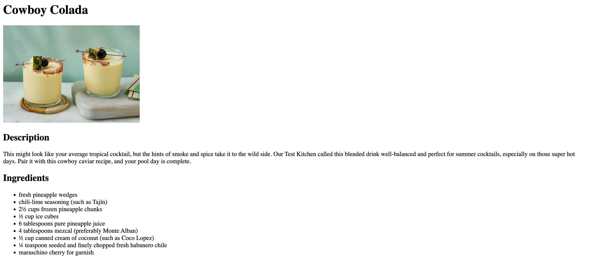

# Odin Recipes

This project is part of **The Odin Project's** Foundational course. This project is meant for demonstrating the proficiency to build a simple website structure using essential HTML elements.

## Project Specifications

The project website consists of a main index page which is linked to a few recipes. Since this project aims to demonstrate the understanding of HTML structure, CSS will not be used — hence the plain styling of the pages.

> Credit: every recipe included in this project is obtained from [Allrecipes](https://www.allrecipes.com/)

## Result Preview

