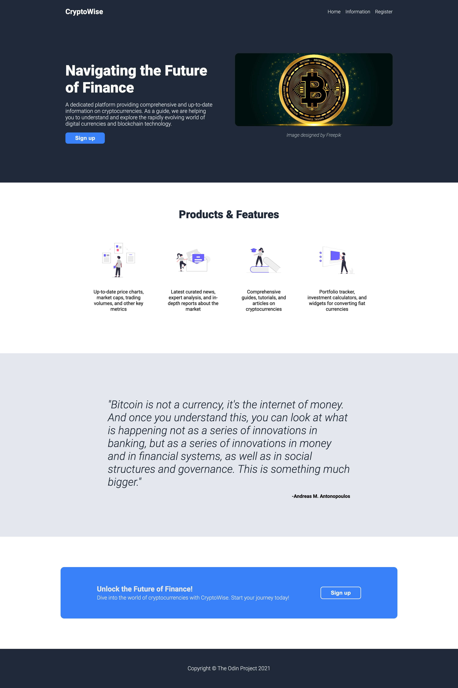

# Project: Landing Page

This project is part of **The Odin Project's** Foundational course. This project is meant for demonstrating the proficiency to create an entire web page from a design using both HTML and CSS. This project requires an understanding of both *HTML structure* and *CSS styling* concept. The CSS styling concepts used in this project is basic CSS and *flexbox* (for layout)

## Project Result

## License & Attribution

- The Bitcoin image in the *Home* section is designed by [Freepik](https://www.freepik.com/free-vector/cryptocurrency-bitcoin-golden-coin-background_13891828.htm#query=bitcoin&position=0&from_view=keyword&track=sph&uuid=698d1761-4991-468f-ac8b-f11b39b10f61)
- The illustration provided in the *Products & Features* section is designed by [unDraw](https://undraw.co/)