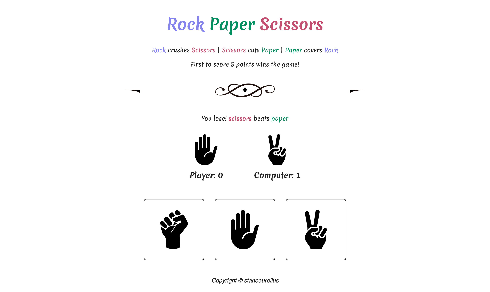

# Project: Rock Paper Scissors

This project is part of **The Odin Project's** Foundational course. This project is meant for demonstrating the proficiency in HTML, CSS, and JavaScript by creating a web page for playing the [Rock-Paper-Scissors](https://en.wikipedia.org/wiki/Rock_paper_scissors) game. This project requires an understanding of:

- *HTML structure* for creating the content & structure of the web page,
- *CSS styling* for creating the layouts and web page styling,
- *JavaScript* for defining the rock-paper-scissors game logic

## Project Result

## License & Attribution

- The color palette used in this website was generated by [ColorSpace](https://mycolor.space/)
- The decorative line divider was designed by [Pngtree](https://www.pngtree.com)
- The illustration of rock-paper-scissors hand gesture was designed by [Flaticon](https://www.flaticon.com/)