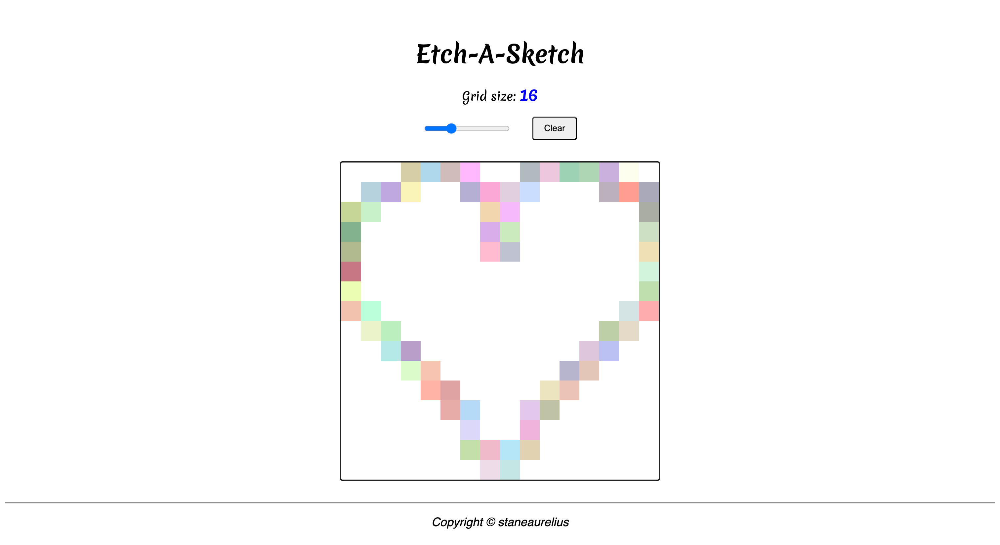

# Project: Rock Paper Scissors

This project is part of **The Odin Project's** Foundational course. This project is meant for demonstrating the proficiency in HTML, CSS, and JavaScript by creating a web page for playing [Etch-A-Sketch](https://en.wikipedia.org/wiki/Etch_A_Sketch) drawing. This project requires an understanding of:

- *HTML structure* for creating the content & structure of the web page,
- *CSS styling* for creating the grid layout and web page styling,
- *JavaScript* for generating the grids and defining the coloring logic

## Project Result

