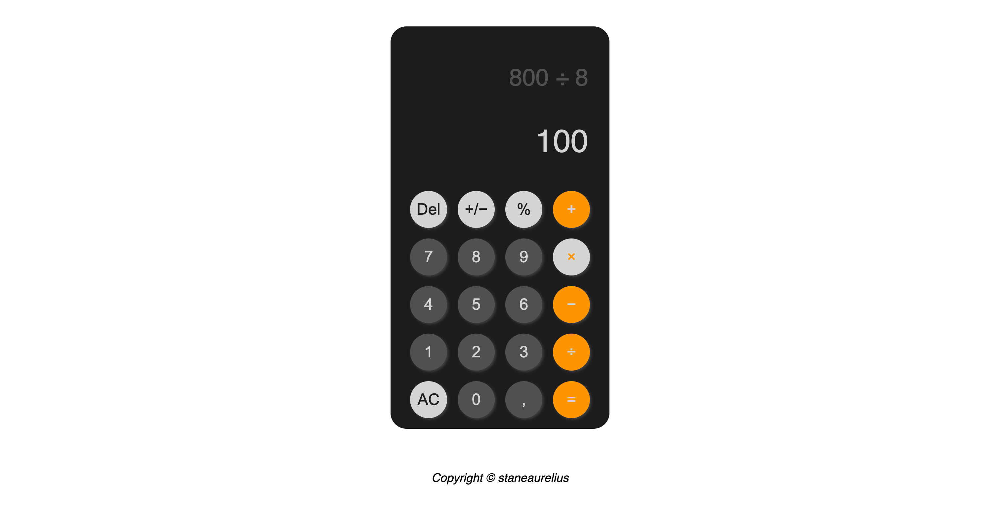

# Project: Calculator

This project is part of **The Odin Project's** Foundational course. This project is meant for demonstrating the proficiency in HTML, CSS, and JavaScript by creating a web page containing [Calculator](https://en.wikipedia.org/wiki/Calculator) This project requires an understanding of:

- *HTML structure* for creating the content & structure of the web page,
- *CSS styling* for creating the calculator design and layout,
- *JavaScript* for defining the calculator operation logic

## Project Result

## Attribution

- This project's calculator design is based on [Apple](https://www.apple.com) mobile Calculator app.